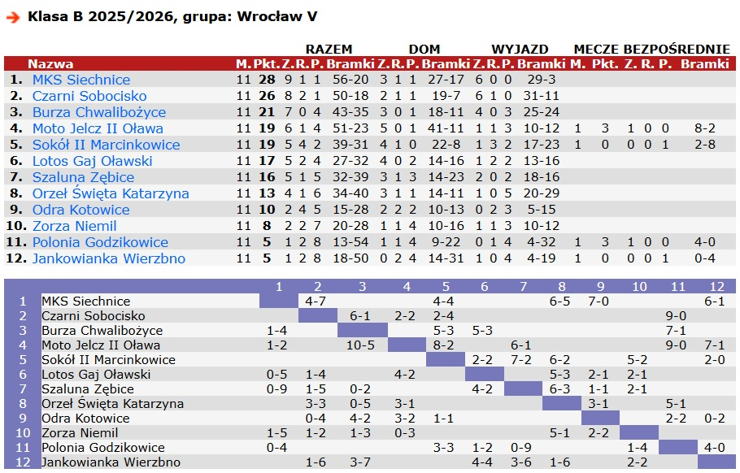
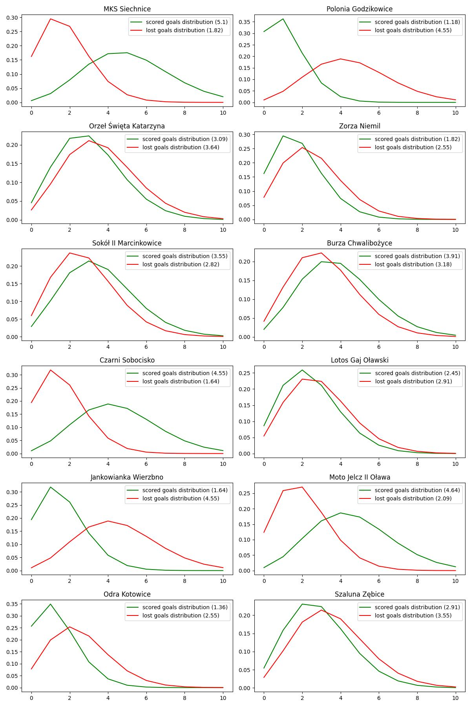
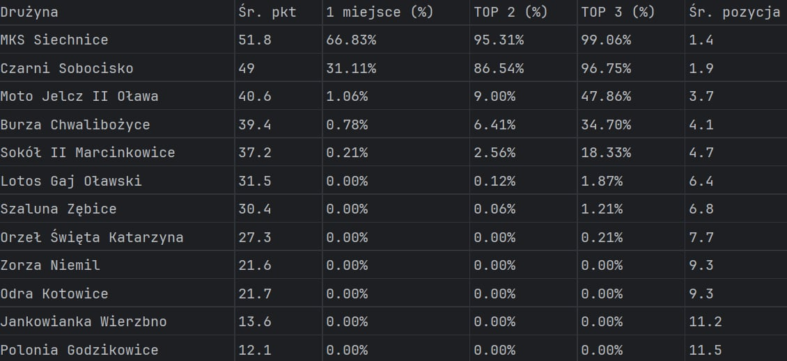

# Simulation of second half of the season for class-B (Wroclaw group V) league

The table below shows league table after winter round (each team played 11 matches).

## Simulation by Monte Carlo method

Goal: Predicts the final standings of a football league by simulating the remaining matches 100,000 times.

Method: Uses Poisson distribution to generate match scores based on weighted team statistics (combining 70% general form and 30% home/away specific form) and a home field advantage factor. We calculate result of specific match based on 4 Poisson distributions (home scored goals / home lost goals / away scored goals / away lost goals)

Output: Calculates the probability of each team winning the title, finishing in the Top 2/3, and their average point total/position, saving the results to an Excel file.

## Sources

All upcoming matches and stats come from:

- [http://www.90minut.pl](http://www.90minut.pl)
- [https://regiowyniki.pl](https://regiowyniki.pl)

## Teams Stats

## Results

